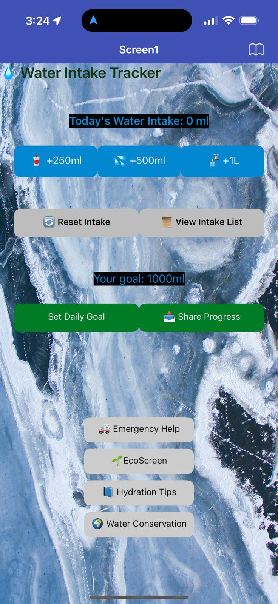
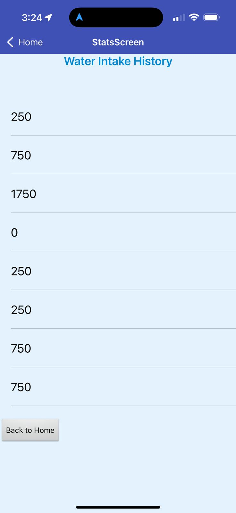
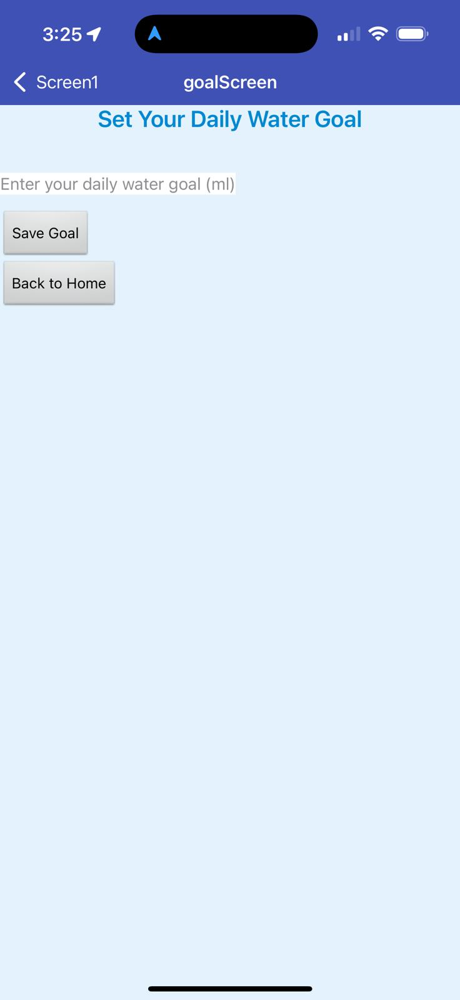
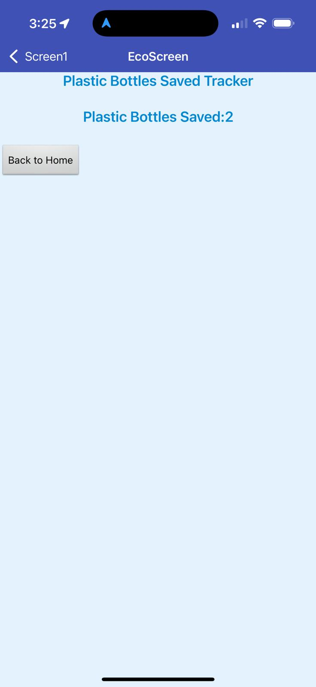
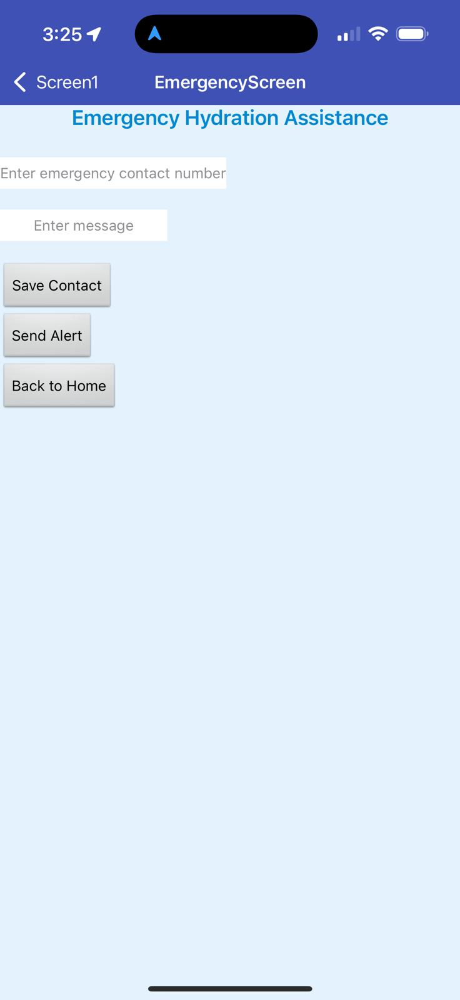
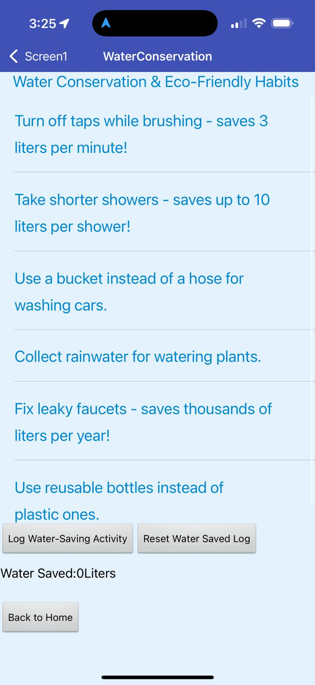
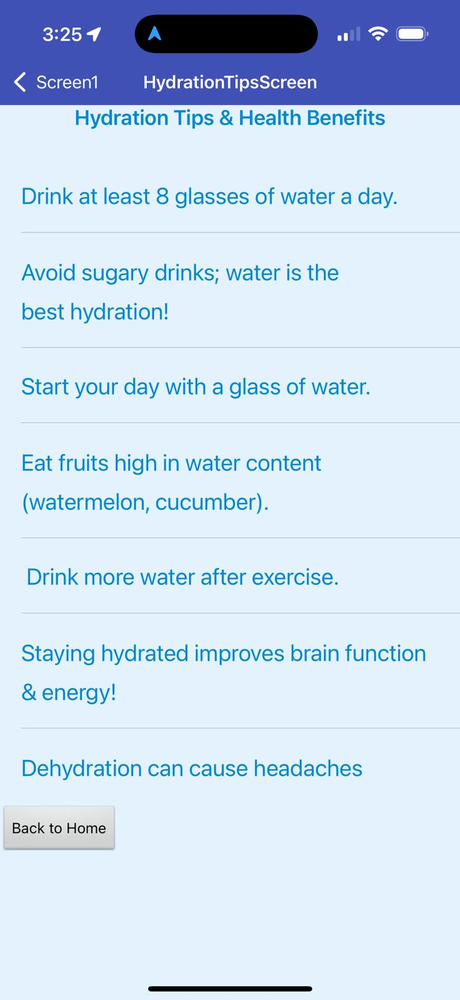

# MIT App Inventor Project
# 💧 Water Intake Tracker App

A mobile application designed to **track daily water intake, set hydration goals, and promote water conservation**. Built using **MIT App Inventor**, this app encourages users to stay hydrated while contributing to environmental sustainability.

---

## ** About The Project**
Staying hydrated is crucial for maintaining a healthy lifestyle, yet many people **forget to drink enough water**. 
This app helps users:

 Track their **daily water intake**  
 Set **personalized hydration goals**  
 Monitor **water-saving efforts** to reduce plastic waste  
 View their **hydration history with charts**  
 Get **hydration tips and eco-friendly suggestions**  

**Built For:**  Android (via MIT App Inventor)  
**Social Impact:**  Encourages hydration & water conservation  

---

## ** Main Screens of the App**
The application consists of multiple screens to enhance user experience:

1️⃣ **Screen1 (Home Screen)**

   - Displays **daily water intake**
   - Buttons to **log water consumption** (+250ml, +500ml, +1L)
   - Displays **total bottles saved** (reducing plastic waste)
   - Quick access to **all features**

2️⃣ **StatsScreen (Water Intake History)**

   - List of **past water intake records**
   - Total water intake summary

3️⃣ **goalScreen (Set Daily Goal)**

   - Allows users to **set a daily hydration goal**
   - Motivational messages based on hydration goals

4️⃣ **EcoScreen (Plastic Bottles Saved)**

   - Displays **how many plastic bottles were saved**
   - Encourages eco-friendly water consumption habits

5️⃣ **EmergencyScreen (Hydration Assistance)**

   - Sends **emergency SMS alerts** if user feels dehydrated
   - Stores **emergency contact details**

6️⃣ **WaterConservationScreen (Eco-Friendly Tips)**

   - Displays **water conservation tips**
   - Encourages users to **save water & reduce plastic waste**

7️⃣ **HydrationTipsScreen (Hydration Awareness)**

   - Educates users on the **benefits of drinking water**
   - Provides **daily hydration tips**
   - 

---

## ** Main Components Used**
The app is built using **MIT App Inventor** and utilizes the following key components:

### ** Data Storage**
- **TinyDB**: Stores **water intake history, daily goal, and bottle savings** across sessions.

### ** Data Visualization**
- **ListView**: Displays **hydration history**.

### ** Connectivity**
- **Texting Component**: Sends **emergency alerts** if dehydration is detected.
- **ActivityStarter**: Enables **social sharing of hydration progress**.

### ** UI Components**
- **Buttons**: For logging water intake & navigating screens.
- **Labels**: Displays key information like **total water intake**.
- **Horizontal & Vertical Arrangements**: Organizes UI layout.
- **Background Images & Icons**: Enhances **eco-friendly aesthetics**.

---

## ** Summary of Features**
 **Track Daily Water Intake**   
 **Set & Monitor Hydration Goals**   
 **View Water Intake History**   
 **Encourage Water Conservation**   
 **Reduce Plastic Waste (Track Bottles Saved)**   
 **Emergency Hydration Assistance**   
 **Hydration & Health Tips**   

---

## ** Installation & Setup**
To install and run the **Water Intake Tracker App**:

1 **Download the `.aia` project file** and open it in **MIT App Inventor**.  
2 **Connect an Android device** or use the **AI Companion** to test the app.  
3️ **Build & Export** the `.apk` file to install on Android.  

---

## ** Author & Contributions**
 Developed by **Saif Ullah** as part of a **Social impact project** to promote hydration and environmental awareness. Contributions are welcome!  

## ** Resources**
## Useful Resources

### **App Idea**
- [Water Intake Tracker App Idea](https://www.youtube.com/watch?v=AuabMme2Iks)

### **TinyDB Usage**
- [How to Use TinyDB](https://www.youtube.com/watch?v=rhkw08U6bsg)

### **Displaying Data in a List**
- [How to Display Data in a List](https://www.youtube.com/watch?v=rAgllUjT6FE&list=PLI4IIyUecnV7HeQ5G51T8CRIez2j-ajRn)

### **Screen Layout**
- [How to Add Spaces in Screen Layout](https://www.youtube.com/watch?v=tm4GeF0UN-U&t=212s)

### **Texting Component**
- [How to Use Texting Component](https://www.youtube.com/watch?v=9I1-4sPbxPc)

### **Reset Button**
- [How to Add a Reset Button](https://www.youtube.com/watch?v=KUF1k0S8WIM)

### **Sharing Progress**
- [How to Share My Progress](https://www.youtube.com/watch?v=fCdxtYj09Zw)

### **Using ChatGPT for Idea and Components**
- [Use ChatGPT for the Idea and Component Help](https://chatgpt.com/share/67b13404-42fc-800b-931c-52dcefb8f648)

If you'd like to **improve the project**, feel free to **fork this repository**, make changes, and submit a pull request.  

---

## ** License**
This project is **open-source** under the **MIT License**.  

 **Enjoy using the Water Intake Tracker! Stay hydrated & help save the planet!** 
